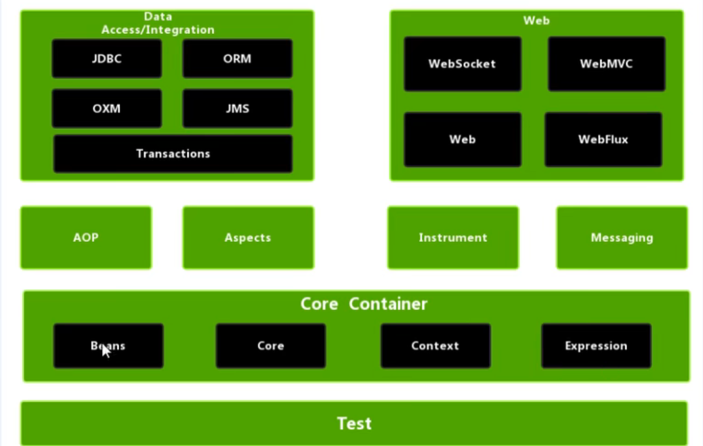

# prepearedstatement
https://gitee.com/yu3hen/preparedstateent

# JDBC API小结
***
- 面向接口编程思想
- ORM思想
  - 一个数据表对应一个java表
  - 表中的一条记录对应java类的一个对象 
  - 表中的一个字段对应java类的一个属性
  - 数据库结果集的元数据
  - 通过反射创建指定的对象
  
  # PreparedStatement
  ***
  - PreparedStatement操作Blob的数据，而Statement做不到
  - PreparedStatement可以实现更高级的批量操作
  - File创建文件指针是项目工程目录
  - 但是maven创建是会将resources创建为资源文件目录
  
  # spring 框架
  ***
- 轻量级开源javee框架
- Spring可以解决企业开发复杂性
- Spring有两个核心的部分：IOC和AOP
  - IOC：控制反转：把创建兑现过程交给Spring管理
  - Aop：面型切面，不修改源代码情况下进行功能增强
- Spring特点
  - 方便解耦简化开发
  - Aop编程支持
  - 方便程序测试
  - 方便集成优秀框架
  - 方便进行事务操作
  - 降低API开发难度
  - Java源码是经典设计规范
  
- IOC概念和原理
  - 什么是IOC 控制反转
    - 控制反转
      - 把对象的创建和对象之间调用的过程，交给Spring管理
      - 使用IOC目的，为了耦合度降低
      - 做入门案例就是IOC实现
    - IOC底层原理
      - xml解析，工厂模式，反射
        - 配置文件，配置创建的对象
        - 有service类和dao类，创建工厂类
    ```
    class UserFactiory{
        public static UserDao getDao(){
            String classValue = class属性值//xml解析
            Class class = Class.forName(classValue);
            return (UserDao)class.newInstance();
        }
    }
    ```
    - IOC接口
    - Spring提供IOC容器实现的两种方式
      - BeanFactory
        - IOC容器基本实现方式，是Spring内部的使用接口
          - 加载皮质文件时候不会创建对象使用对象是否不会创建对象
      - ApplicationContext
        - BeanFactory接口的子接口，提供更多更强大的功能，一般由开发人员使用。
- Bean管理操作
  - Spring创建对象
  - Spring注入属性
- Bean管理操作有两种方式
  - 基于xml配置文件有两种方式
    - 基于xml配置文件方式
    - 基于注解方式实现
      - spring配置中，使用bean标签，标签中添加相应属性，就可以实现对象创建
      - id属性
      - class属性全类名
      - name属性
    - 创建对象的时候，默认也是执行无参数构造方法完成对象创建。
    - xml方法依赖注入
    - set方法注入
    - 有参构造注入
  # Maven
  ***
  https://daimajiaoliu.com/daima/60ec9cec9055003
查询maven/resources的方式
