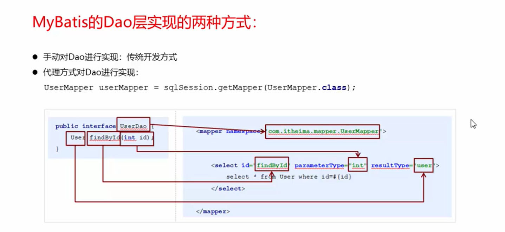

# 代理开发方式介绍
- Mapper.xml文件中的namespace与mapper接口的全限定名相同
-  Mapper接口方法名和Mapper.xml接口定义每个Statement的id相同
-  Mapper接口方法的输入参数类型和mspperxml中定义的每个sql

# Mybatis的Dao层实现
- MybatisDao层
-  

# MyBatis映射文件深入
-  <select>查询
- <insert>插入
- <delete> 删除
-  <update> 修改
-  <where> where条件
-  <if> if判断
-  <foreach>循环
-  <sql> sql片段抽取