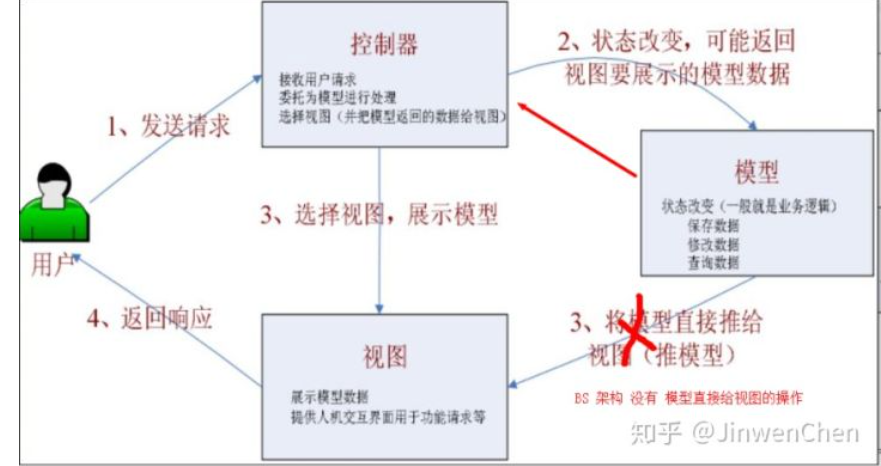
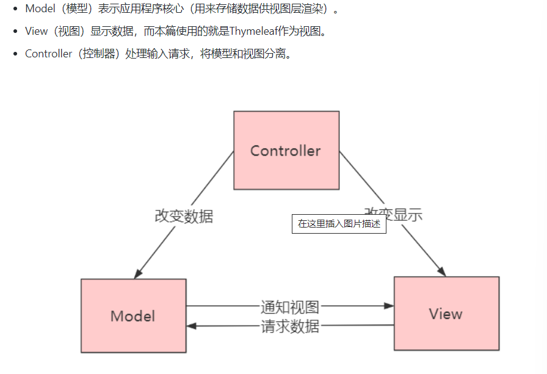
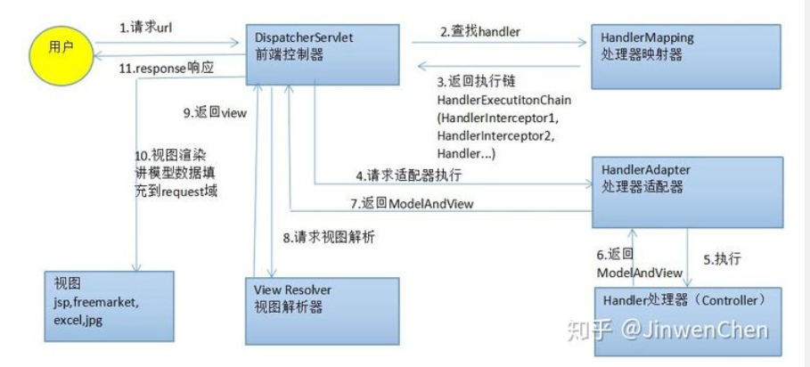
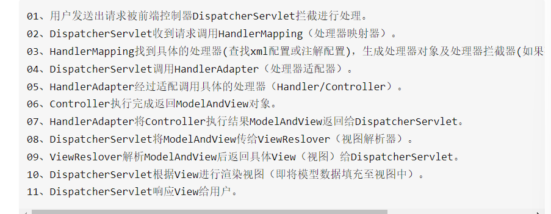
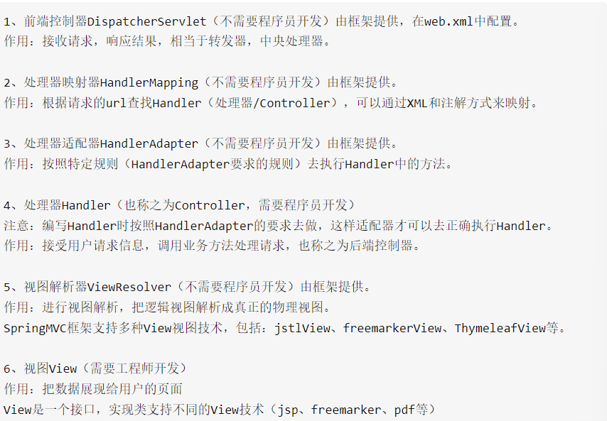

# Springboot整合其他框架
- SpringBoot整合Junit
- 搭建SpringBoot工程
- 引入Starter-test起步依赖
- 编写测试类
- 添加测试相关
- 编写测试方法

- SpringBoot整合Redis框架

# Redis简介
***
- 问题现象
  - 高并发
  - 海量用户
- 罪魁祸首关系型数据库 
  - 性能瓶颈：cipanIO性能低下
  - 扩展瓶颈：数据管旭复杂，扩展性差，不便于大规模集群
- 解决思路
  - 降低磁盘IO次数，越低越好
  - 去除数据间关系，越简单越好
- Nosql作为关系型数据的补充
- 作用基于海量用户和数据前提下处理问题
- 可扩展，可伸缩
- 大数据量下高性能
- 商品基本信息
  - 名称
  - 价格
  - 厂商
- 商品附加信息
  - 描述
  - 详情
  - 评论
- 图片信息 分布式文件系统
- 搜关键字 ES,Lu册呢，Solr
- 热点信息 高频，波动性
- Reids是用C语言开发的一个开源高性能键值对数据库
  数据见没有必然关联关系
- 内部采用单线程机制进行工作
- 多数据类型支持
- 高性能
- 持久化支持，可以进行数据灾难
- redis 数据存储格式
- 数据类型指的是key:value中value中数据
- 修改添加多个数据
- 获取多个数据
- mget key1 key2
- strlen key
- append key value
- Mysql分库分表带来的问题
- 水平分表
- 每个库结构不一样
- 每个库数据不一样
- 每个库的并集是全量数据
- 有点
- 单库的数据保持在一定量有助于性能提高
# thymeleaf
***
- 什么是Thymeleaf模板引擎在整个web项目中起到的作用为视图展示
- model-view-controller是模型视图控制器的缩写，其中Model表示应用程序核心
- view显示数据，而本片使用的就是Thymeleaf作为视图。
- COntroller处理输入请求，将模型和视图分离。
- MVC设计模式成需要很多优点比如降低程序耦合，增加代码的复用性，景帝开发程序和接口的成本
  
  
  
  
  
- 你可能还是不明白什么才是真正的动静分离，其实这个主要是由于Thymeleaf模板基于html，后缀也是.html，所以这样就会产生一些有趣的灵魂。
- - 对于传统jsp，是.jsp然后在文件中添加自己的语法然后标签修改后缀为jsp然后就在这个文件添加自己的语法