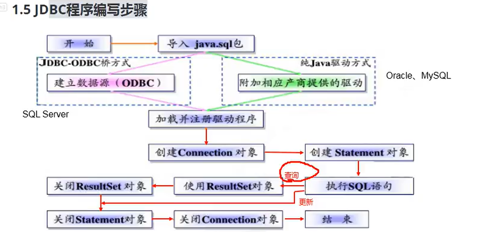
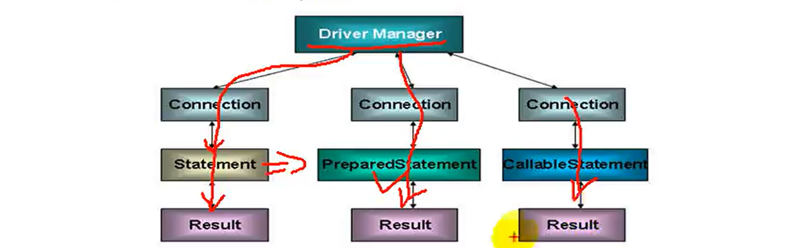
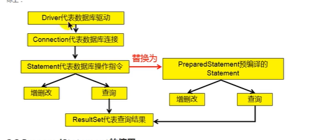

# maven
***
可以通过reload来重启maven

# project Structure
***
resoureces资源架构中存放资源会自动在其中存放资源

# 反射
***
https://www.jianshu.com/p/c74e0390d6e9
- 反射基本原理

# 泛型
***
https://www.liaoxuefeng.com/wiki/1252599548343744/1265102638843296
https://blog.csdn.net/romantic112/article/details/80513372

# Integer Double等类
***
大多基本数据类型的包装类都继承自Number抽象类
https://www.cnblogs.com/ysocean/p/8075676.html

# 异常
***

https://zhuanlan.zhihu.com/p/199053897

# JAVA IO流
***
- 节点流，处理流
- 输入流，输出流
- 字符流，字节流
  -InputStream,Reader,OOutputStream,Writer
-字符流不能处理非文本类数据
```
@Test
//字符流只能够处理文本文件字节流能处理图像文件
    public   void testDileReader() throws IOException {
        File file = new File("hello.txt");

    try {
        FileReader fr = new FileReader(file);
        //read读入一个字符，如果达到文件的末尾返回-1.
        int data= fr.read();
        while(data != -1){
            System.out.print((char)data);
            data = fr.read();
        }
        fr.close();
    } catch (IOException e) {
        e.printStackTrace();
    }
}
    public void testFileReader1() throws IOException {
        File file1 =  new File("hello.txt");
        FileReader fr = new  FileReader(file1);
        char[] cbuf = new char[5];
        fr.read(cbuf);
    }
```
```
  @Test
    public  void BufferedStreamTest() throws IOException {
        File srcFile = new File("picture1.png");
        File destFile = new File("picture2.png");

        BufferedOutputStream bos = null;
        BufferedInputStream bis = null;
        try {
            FileInputStream fis = new FileInputStream(srcFile);
            FileOutputStream fos = new FileOutputStream(destFile);
            bis = new BufferedInputStream(fis);
            bos = new BufferedOutputStream(fos);
            byte[] buffer = new byte[10];
            int len;
            while ((len = bis.read(buffer)) != -1) {
                bos.write(buffer, 0, len);
            }
        } catch (FileNotFoundException e) {
            e.printStackTrace();
        } catch (IOException e) {
            e.printStackTrace();
        } finally {
            bos.close();
            bis.close();

        }
```
# JDBC
***


# 第一种创建方式
***

```
 @Test
    public void testConnection1() throws SQLException {

        Connection conn = null;
        try {
            Driver driver = new com.mysql.jdbc.Driver();
            //jdbc:mysql:协议
            //localhost:ip地址
            //3306默认mysql的端口号
            //Tables:Tables数据库
            String url = "jdbc:mysql://localhost:3306/book?useSSL=false";
            Properties info = new Properties();
            info.setProperty("user", "root");
            info.setProperty("password", "123456");

            conn =  driver.connect(url, info);
        } catch (SQLException e) {
            e.printStackTrace();
        } finally {
            System.out.println(conn);
        }

```
```
  /*
    * 通过读取配置文件的方式得出信息
    * 好处是获取的配置在外面
    * 此时可以实现解耦
      *
      * */
    @Test
    public void testConnection5() throws IOException, ClassNotFoundException, SQLException {
        InputStream inStream = ConnectionTest.class.getClassLoader().getResourceAsStream("jdbc.properties");
        Properties pros = new Properties();
        pros.load(inStream);
        String user = pros.getProperty("username");
        String password = pros.getProperty("password");
        String url = pros.getProperty("url");
        String driver = pros.getProperty("driver");
        //2.加载驱动
        Class.forName(driver);
        Connection conn = DriverManager.getConnection(url, user, password);
        System.out.println(conn);

    }
```


- 创建一个statement的目标是可以通过java执行数据
  # PreparedStatement
  ***
  